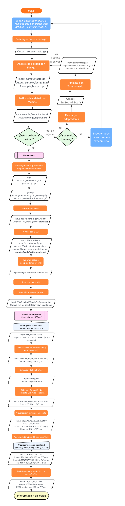
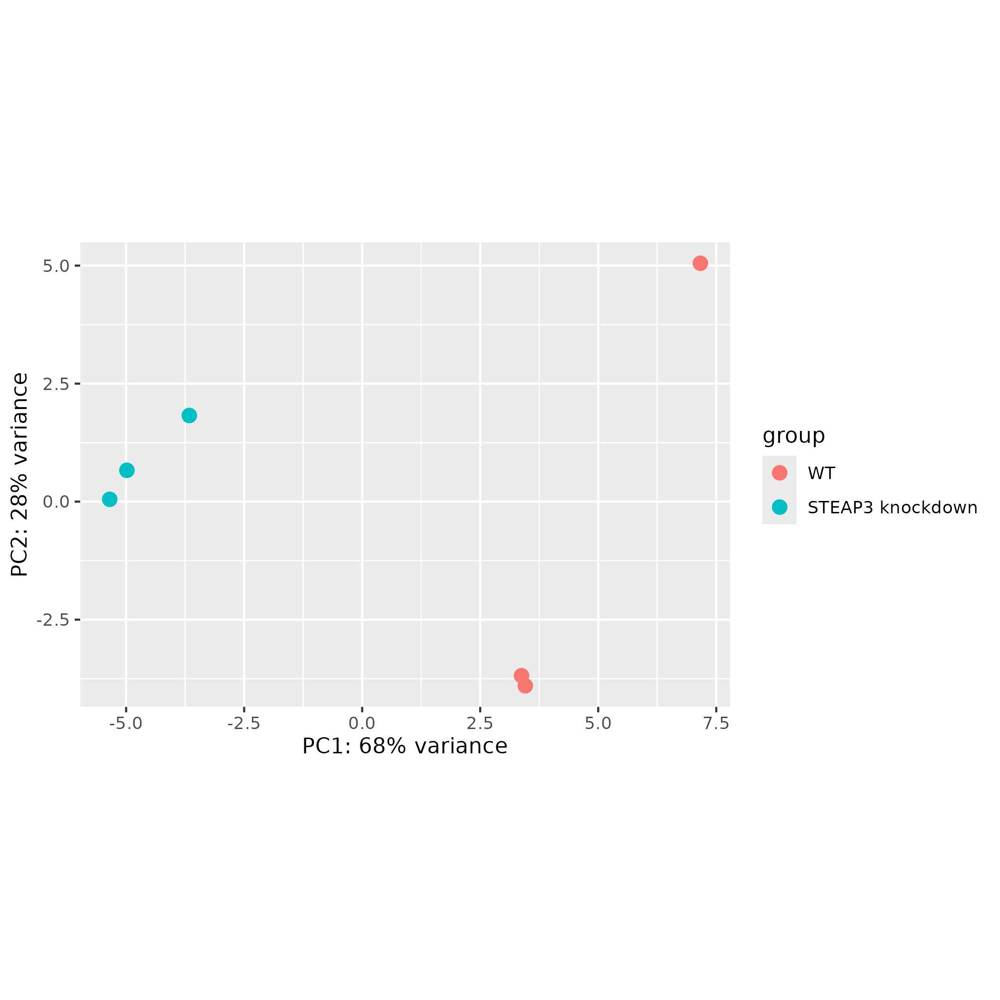
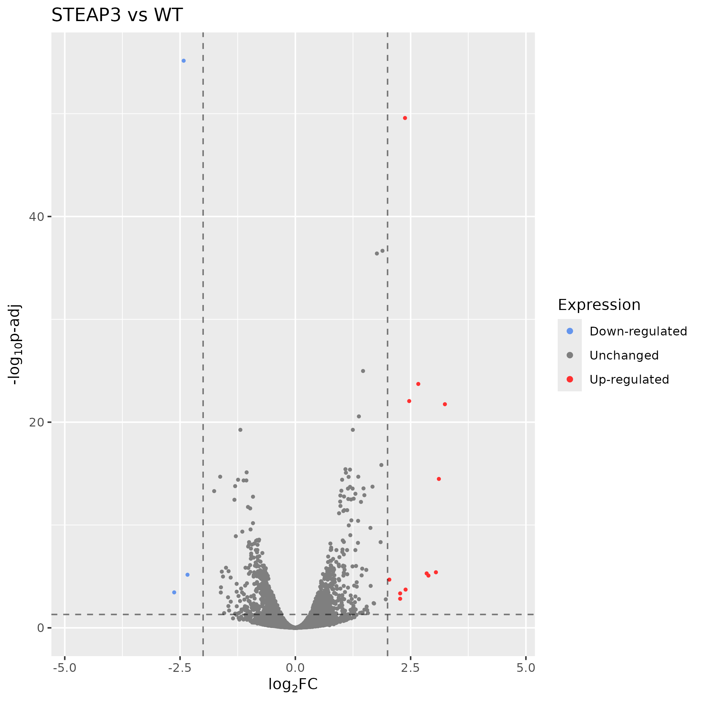
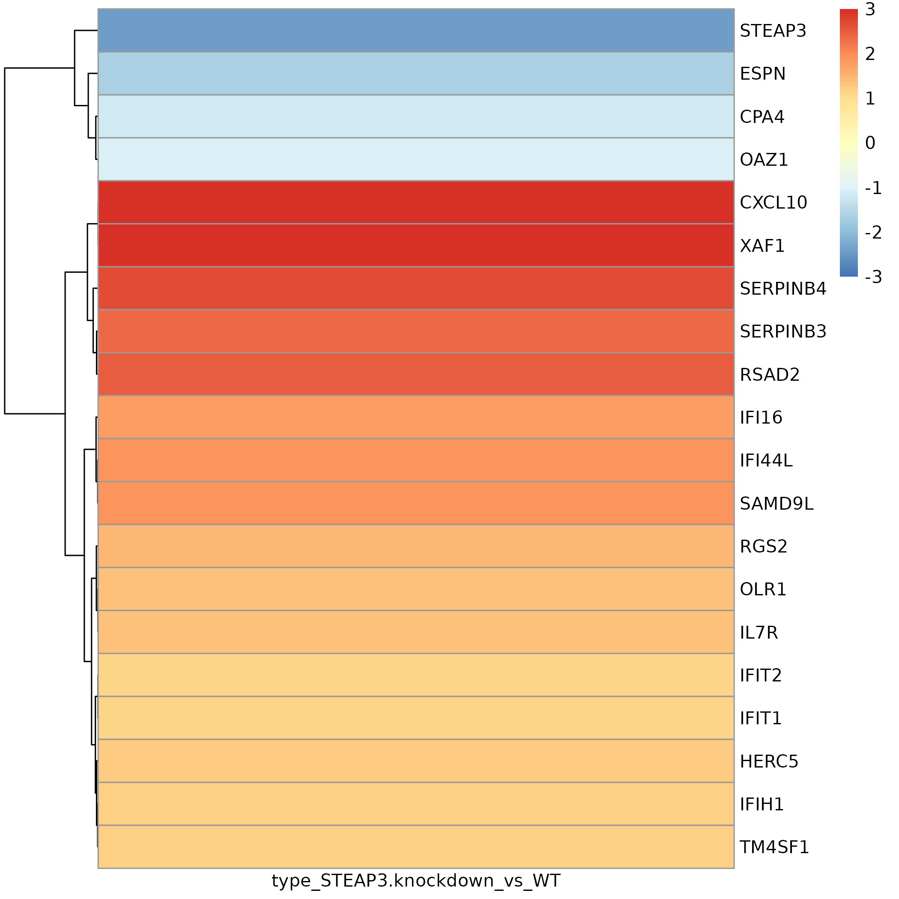
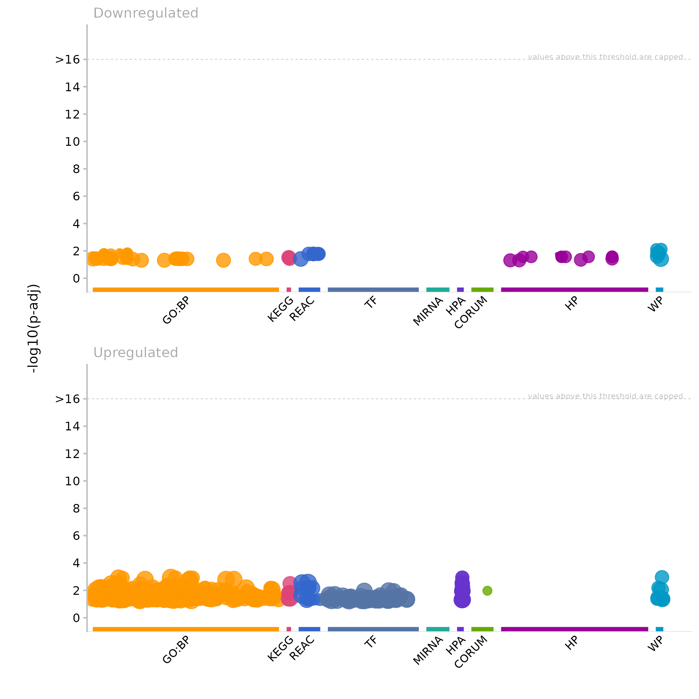

# Descripción del equipo

-   **Equipo:** 2

-   **Integrantes:**

    -   Leonardo González López (lgonzalez) -
        [minestev17\@gmail.com](mailto:minestev17@gmail.com){.email},
    -   Efrén Nosedal González (enosedal) -
        [enosedal\@gmail.com](enosedal@gmail.com),
    -   Yuliana Denisse Sosa Gómez (ysosa) -
        [yuliana.sogo2006\@gmail.com](mailto:yuliana.sogo2006@gmail.com){.email}

# Descripción de los datos

+---------------------------+---------------------------+
| Descripción               | Información               |
+===========================+===========================+
| BioProject                | PRJNA1198873              |
+---------------------------+---------------------------+
| Especie                   | *Homo sapiens*            |
+---------------------------+---------------------------+
| Tipo de bibliotecas       | *paired-end*              |
+---------------------------+---------------------------+
| Método de selección       | Purificación de           |
|                           | transcritos               |
|                           | poliadenilados (poli-A)   |
+---------------------------+---------------------------+
| Número de transcriptomas  | 6                         |
+---------------------------+---------------------------+
| Número de réplicas        | 3 replicas biológicas por |
| biológicas                | condición (control y      |
|                           | knockdown)                |
+---------------------------+---------------------------+
| Secuenciador empleado     | Illumina NovaSeq 6000     |
+---------------------------+---------------------------+
| Distribución de las       | -   **Control**: 3        |
| muestras                  |     réplicas biológicas   |
|                           |     WT (SRR31732089,      |
|                           |     SRR31732090,          |
|                           |     SRR31732091)          |
|                           |                           |
|                           | -   **Sobreexpresión**: 3 |
|                           |     réplicas biológicas   |
|                           |     con knockdown de      |
|                           |     *STEAP3*              |
|                           |     (SRR31732086,         |
|                           |     SRR31732087,          |
|                           |     SRR31732088)\n        |
+---------------------------+---------------------------+
| Profundidad de            | 19 - 24 M seq             |
| secuenciación de cada     |                           |
| transcriptoma             |                           |
+---------------------------+---------------------------+
| Tamaño de las lecturas    | 148 bp                    |
+---------------------------+---------------------------+
| Artículo científico       | Zhao Z, Yu P, Wang Y, Li  |
|                           | H et al. Silencing of     |
|                           | STEAP3 suppresses         |
|                           | cervical cancer cell      |
|                           | proliferation and         |
|                           | migration via JAK/STAT3   |
|                           | signaling pathway. Cancer |
|                           | Metab 2024 Dec            |
|                           | 30;12(1):40. PM ID: [3973 |
|                           | 675                       |
|                           | 1](htt%20%2%200%2         |
|                           | 0%20%20%20%20p%%20%2020%2 |
|                           | 0s:%20%20%20//%20%%2020ww |
|                           | w%%2020%%20%2020%%2020.%2 |
|                           | 0n%%20%202%200c%20bi%20%2 |
|                           | %200.n%20%%2020%%2020%20l |
|                           | %20m.n%%%20202%200i%%202% |
|                           | 200%%%2%2002020h%2%200.%2 |
|                           | %200g%%2%20%200%2020o%%20 |
|                           | 20%20%20%20v%20/p%20%20ub |
|                           | %%202%200m%20ed/%203%20%% |
|                           | 20209%20%%20%2%200%2020%% |
|                           | 20207%2%2%200%%202003%20% |
|                           | 2%200%%%20202%20%2%2000%2 |
|                           | 0%206%207%20%%20%%2020%20 |
|                           | 2%200%205%20%%202%200%201 |
|                           |  "Link to PubMed record") |
+---------------------------+---------------------------+

: Tabla 1: Detalles del Bioproyecto y características de las muestras

## Resumen del BioProject

El artículo “Silencing of STEAP3 suppresses cervical cancer cell
proliferation and migration via JAK/STAT3 signaling pathway” propone
investigar los mecanismos de STEAP3 en la proliferación y migración
celular en cáncer cervical. SYEAP3 pertenece a la familia de las
proteínas STEAP los cuáles se ha reportado que participan en la
proliferación y metástasis del cáncer. Con RNA-seq se comparó la
expresión de las vías de señalización en las cuáles participa STEAP3 en
presencia de STEAP3 (NC) y con knockdown del gen (KD) en células de la
línea celular HeLA.

Se utilizaron todas las muestras del dataset, correspondiendo a 3
réplicas biológicas de células de la línea celular HeLA con knockdown en
el gen STEAP3. La información se encuentra en la **Tabla 2**.

```{r echo=FALSE, message=FALSE, warning=FALSE}
library(DT)

# ejemplo de data frame
df <- data.frame(
  muestras = c("GSM8682795", "GSM8682794", "GSM8682793", "GSM8682792", "GSM8682791", "GSM8682790"),
  condicion = c("STEAP3 knockdown", "STEAP3 knockdown", "STEAP3 knockdown", "WT", "WT", "WT"),
  SampleID = c("SAMN45855841", "SAMN45855842", "SAMN45855843",
                "SAMN45855844", "SAMN45855845", "SAMN45855846"),
  replica_biologica = c("KD_3", "KD_2", "KD_1",
                        "NC_3", "NC_2", "NC_1")
)

# tabla interactiva
datatable(
  df,
  caption = "Tabla 2. Distribución de las muestras y réplicas biológicas",
  options = list(
    pageLength = 6,   # Show 6 entries
    lengthMenu = c(6, 10, 20),
    searching = TRUE,
    paging = TRUE
  )
)
```

# Diagrama de flujo de trabajo



# Resultados

## Estructura del trabajo

La **estructura** de las carpetas dentro del cluster se puede observar a
continuación, la cual contiene carpetas compartidas con la estructura
dentro de Github:

Los **outlogs** de los scripts se pueden observar
[aquí](https://github.com/leonardoglez6/Equipo2/tree/main/out_logs).

## 1. Obtener datos crudos

Buscamos nuestro BioProject dentro de ENA (European Nucleotide Archive),
para poder seleccionar las muestras. Posteriormente, utilizamos el
comando `wget` para las 12 muestras (6 muestras con su respectiva
lectura forward y reverse).

El script correspondiente se puede encontrar dentro del GitHub, en la
ruta
[scripts/01_DownloadRawData.sh](https://github.com/leonardoglez6/Equipo2/blob/main/scripts/01_DownloadRawData.sh)

## 2. Análisis de calidad de las secuencias de los datos crudos

Se realizó el análisis de calidad de las 6 muestras seleccionadas con el
programa **FastQC**, primero de forma individual y después generando un
MultiQC.

El script correspondiente se puede encontrar dentro del GitHub, en la
ruta
[scripts/02_Quality_raw.sh](https://github.com/leonardoglez6/Equipo2/blob/main/scripts/02_Quality_raw.sh)

Se obtuvo un contenido de GC aproximado de 50% formando una distribución
normal, característica de un resultado esperado de buena calidad, y una
cobertura que varía del rango de 19M - 24.7M.


Las muestras tienen una calidad óptima dentro de las posiciones de las
lecturas, con valores dentro de la zona verde y un puntaje Phred
superior a 35. De igual forma, las muestras tienen un promedio de
calidad con un pico máximo en Phred 36.


El porcentaje de contenido de bases indeterminadas (N) en los reads
superó la prueba, así como la prueba de secuencias sobrerepresentadas y
no se encontraron muestras con contaminación de adaptadores.


{width="1037"}

Sin embargo, se identificaron secuencias duplicadas, que posiblemente
puedan estar relacionadas con la presencia de dímeros de adaptadores.


### Conclusión de la calidad de los datos crudos

Al terminar de analizar los datos, concluimos que son adecuados para el
desarrollo del proyecto. Por lo general, las secuencias tienen buena
calidad con valores Phred mayores a 30 y tienen un porcentaje de GC
correcto. Además de que los posibles errores por secuencias duplicadas
se podrían mejorar al remover los adaptadores.

Podemos concluir que podemos continuar utilizando esta base de datos
para análisis futuros, pero debemos realizar la limpieza correspondiente
para mejorar la calidad de los mismos.

## 3. Trimming de datos crudos

Se realizó el trimming de los datos para quitar secuencias de mala
calidad y remover la posible presencia de adaptadores dentro de los
datos.

De manera previa, se descargaron las secuencias de los adaptadores a
eliminar *TruSeq3 Paired End* debido a las características de nuestros
datos. Posteriormente, se utilizó el programa **Trimmomatic** con los
siguientes parámetros:

-   `LEADING:3` Elimina bases del inicio del read si su calidad es menor
    a 3

-   `TRAILING:3` Elimina bases del final del read si su calidad es menor
    a 3

-   `SLIDINGWINDOW:4:20` Recorre read con ventana de 4 bases y corta si
    calidad promedio es menor a 20.

-   `MINLEN:80` Descarta reads con menos de 80 bases después del
    trimming

El script correspondiente se puede encontrar dentro del GitHub, en la
ruta
[scripts/03_Trimmed.sh](https://github.com/leonardoglez6/Equipo2/blob/main/scripts/03_Trimmed.sh)

## 4. Análisis de calidad de las secuencias de los datos procesados

Se realizó el análisis de calidad de las 6 muestras tras el trimming con
el programa **FastQC**, primero de forma individual y después generando
un MultiQC.

El script correspondiente se puede encontrar dentro del GitHub, en la
ruta
[scripts/04_Quality_trimmed.sh](https://github.com/leonardoglez6/Equipo2/blob/main/scripts/04_Quality_trimmed.sh)

Se obtuvo un contenido de GC aproximado de 50% formando una distribución
normal, característica de un resultado esperado de buena calidad, y una
cobertura que varía del rango de 17.9M - 23.2M.


Las muestras tienen una calidad óptima dentro de las posiciones de las
lecturas, con valores dentro de la zona verde y un puntaje Phred
superior a 36.


El porcentaje de contenido de bases indeterminadas (N) en los reads
superó la prueba, así como la prueba de secuencias sobrerepresentadas y
no se encontraron muestras con contaminación de adaptadores los cuales
fueron removidos utilizando `trimmomatic` versión 0.33.


{width="1116"}

La presencia de secuencias duplicadas se mantuvo como una prueba
fallida, sin embargo, son resultados esperados al realizar RNA-seq.


Se encuentra un sesgo en las primeras 15 bases en la gráfica de Per base
sequence content, sin embargo, se reporta que es normal para RNA-seq.

### Conclusión de la calidad de datos procesados

El procesamiento de los datos utilizando `trimmomatic` redujo la
cobertura de las secuencias, indicativo que removió lecturas de mala
calidad, y todos los reads pasaron la prueba de contenido de
adaptadores, por lo cuál indica que fueron removidos.

El tamaño de las reads iniciales (datos crudos) y las finales (datos
procesados) se mantuvo igual.

## 5. Generar index de STAR

Antes de realizar el alineamiento de las secuencias, es fundamental
realizar el indexado para acceder a los datos de forma más eficiente.
Para ello se obtuvo el genoma de referencia humano desde NCBI, versión
*GRCh38.p14*, en formato FASTA (secuencia) y GTF (anotaciones).

Posteriormente, se realizó el indexado con STAR, utilizando los
siguientes parámetros:

-   `--run ThreadN 30` Usa 30 threads en paralelo para mayor velocidad

-   `--runMode genomeGenerate` Genera el índice del genoma

-   `--genomeDir ./align/STAR/STAR_index` Indica ruta donde se guardarán
    los índices

-   `--genomeFastaFiles` Recibe el archivo FASTA del genoma de
    referencia

-   `--sjdbGTFfile` Recibe el archivo GTF del genoma de referencia

-   `--sjdbOverhang 149` Define el tamaño de la secuencia alrededor de
    los splice junction (punto de unión entre dos exones), el valor
    óptimo es `longitud read - 1`

El script correspondiente se puede encontrar dentro del GitHub, en la
ruta
[scripts/05_STAR_index.sh](https://github.com/leonardoglez6/Equipo2/blob/main/scripts/05_STAR_index.sh)

## 6. Alineamiento de secuencias con STAR

Se realizó el alineamiento de las secuencias con STAR, debido a su alta
precisión y velocidad de mapeo. Para ello, se utilizaron las secuencias
de los datos procesados y el índice previamente generado. Además, se
realizó el conteo de las lecturas por genes. Se utilizaron los
siguientes parámetros:

-   `--runThreadN 12` Usa 12 threads en paralelo para mayor velocidad

-   `--genomeDir` Recibe la ruta del índice

-   `--readFilesIn` Recibe las secuencias de los datos procesados (ambas
    lecturas paired-end)

-   `--outSAMtype BAM SortedByCoordinate` Convierte archivo de salida
    SAM a BAM y ordenados por posición en el cromosoma

-   `--quantMode GeneCounts` Cuenta lecturas por genes

-   `--readFilesCommand zcat` Descomprime datos mientras los analiza

-   `--outFileNamePrefix` Define ruta donde se guardan resultados por
    muestra

El script correspondiente se puede encontrar dentro del GitHub, en la
ruta
[scripts/06_STAR_align.sh](https://github.com/leonardoglez6/Equipo2/blob/main/scripts/06_STAR_align.sh)

## 7. Importar datos de cuentas en R

Posterior al alineamiento con STAR, es necesario importar los datos
provenientes de este a R para el posterior análisis de Expresion
diferencial con DESEq2. En nuestro caso, realizamos el análisis con R
versión 4.4.1 dentro del cluster.

El script correspondiente al alineamiento se puede encontrar dentro del
GitHub, en la ruta `scripts/07_Load_data_STAR.R`

Al terminar este script, contamos con una matriz de cuentas crudas de
los datos y cargamos los metadatos. Ambos se encuentran en la ruta de
github `results/counts/raw_counts.RData` como un dataset de R para
cargar.

# Expresión diferencial

Buscamos hacer nuestro análisis de expresión diferencial a partir de la
matriz de cuentas obtenida. El script correspondiente se puede encontrar
dentro del GitHub, en la ruta `scripts/09_DEG_STAR_KD.R`.

Cargamos nuestra matriz de cuentas crudas generada y la metadata para
posteriormente, seleccionar los genes con más de 10 cuentas.

Al convertirlas al formato dds, observamos que teníamos 6 muestras y
17266 genes hasta este punto. Para después realizar las comparaciones,
indicando cual es la referencia ("WT"). Guardamos el resultado de la
salida en el archivo `results/STEAP3_KD_vs_WT.RData` el cual contiene la
metadata y el archivo dds.

Posteriormente, hicimos la normalización de los datos para evitar sesgos
técnicos y biológicos. Utilizamos la función `rlog` debido a que tenemos
pocas muestras (\<30).

Finalmente, pudimos detectar que no hay Batch Effect tras hacer el PCA
de las cuentas, donde podemos notar las diferencias entre muestras con
las componentes que explican la mayor cantidad de varianza en nuestros
datos, donde se observa que se agrupan las muestras control (WT) y dos
de las muestras de células con knockdown del gen STEAP3 se agrupan
mientras que la muestra restante de los casos se encuentra alejada de
todas las demás.



Obtuvimos la información del único contraste entre Wild-Type y
Knockdown, y guardamos los resultados en el archivio
`results/DE_KD_vs_WT.csv`. Dentro de él podemos observar que en el
resumen se reportan 744 genes con un LFC \> 0, y 825 con un LFC \< 0.

## Visualización de los datos

Algunas de las gráficas generadas a partir de estos datos se muestran a
continuación.

Previamente, se filtraron los genes que tuvieran un p-valor ajustado
menor a 0.05. Y, sumado a ello, para clasificarlos como up-regulated que
tuvieran LFC ≥ 2, y para down-regulated LFC ≤ 2.

Para el Volcano Plot, observamos 3 genes down-regulated y 12 genes
up-regulated. El gen down-regulated con mayor p-value es *STEAP3* y el
gen up-regulated con mayor p-value es *SERPINB3*.



Por otro lado, realizamos un Heatmap, donde obtuvimos los 20 genes con
el p-valor más significativo, y creamos un filtro donde el Log Fold
Change máximo fuera 3, de esta manera evitamos sesgar los resultados por
los outliers.



# Análisis funcional

Realizamos la determinación funcional de los genes diferencialmente
expresados a partir de los datos. El script correspondiente se puede
encontrar dentro del GitHub, en la ruta `scripts/10_GO_terms_STAR.R`.

Se realizó el mismo filtrado que realizamos en la sección de
"Visualización de los datos" para realizar las gráficas.

Primero, realizamos un Manhattan plot. Mediante este plot podemos
observar la cantidad de vías metabólicas observadas en cada base de
datos, representadas por un punto del color correspondiente.



Por otro lado, también podemos realizar una gráfica de barras con la
información de los genes down-regulated, ordenados por su p-valor y
categoría. En esta gráfica podemos observar las vías metabólicas
relacionadas a los genes down-regulated, y de igual forma de que base de
datos provienen cada una de ellas.

Algunas vías relacionadas a los genes que disminuyen su expresión son:

-   **Ferroptosis**: una forma de muerte celular programada dependiente
    de hierro.

-   **Metabolismo del cobre y hierro:** importación de iones de cobre y
    hierro, concentración epática elevada de hierro, transporte y
    abosrbción de hierro, metabolismo del hierro en la placenta,
    desórdenes del metabolismo del hierro, homesotasis del cobre,
    saturación de la transferina (proteína que transporta hierro)

-   **Crecimiento** celular y regulación de *TP53*

-   **Contracción muscular**: contracción del corazón, músculo liso de
    la vena, músculo liso arterial, músculo liso tónico, etc

-   **Ciclos de GTPasas:** *RHOJ*, *RHOO*, *RHOF*, *RHOD*


De igual forma podemos observar las vías metabólicas relacionadas a los
genes up-regulated. Algunas vías son:

-   **Proteólisis**: regulación negativa de actividad de peptidasas,
    hidrolasas, actividad catalítica y funciones moleculares

-   **Respuesta inmune:** respuesta a virus, respuesta simbionte,
    respuesta a otros organismos, estímulos bióticos o estímulos
    externos, respuesta de defensa, regulación del sistema inmune,
    regulación de linfocitos, respuesta a estrés, señalización autócrina
    y parácrina


# Discusión

En el artículo de origen se menciona que se obtuvieron 151 genes
up-regulated y 91 genes down-regulated, resultado el cuál difiere
bastante de lo obtenido por nosotros (12 up-regulated y 3
down-regulated). Esto posiblemente puede ser explicado por el hecho de
que los autores originales utilizaron diferentes programas a lo largo
del análisis bioinformático (alineamiento con HISAT2, mapeo de lecturas
con StringTie, mezcla de los transcriptomas con gffcompare, conteo de
lecturas con StringTie y ballgown), lo cual como posible resultado
permitió que los autores filtraran el análisis de expresión diferencial
de genes (DEGs) utilizando la métrica de False Discovery Rate (FDR) con
un treshold de \< 0.05, en lugar de aplicarlo para el p-value como se
realizó en este reporte, incluso al haberlo realizado con DESeq2 al
igual que los autores.

La siguiente tabla pertenece a una tabla suplementaria del artículo en
la cual enlista todos los DEGs, su Log2FoldChange, p-value y FDR.

```{r}
filas <- rbind(
  c("STEAP3", 0.18, -2.46, 0.00, 0.00),
  c("SERPINB3", 5.29, 2.40, 0.00, 0.00),
  c("IFI44L", 3.77, 1.92, 0.00, 0.00),
  c("IFI16", 3.53, 1.82, 0.00, 0.00),
  c("SERPINB4", 6.32, 2.66, 0.00, 0.00),
  c("RGS2", 2.80, 1.48, 0.00, 0.00),
  c("CXCL10", 9.87, 3.30, 0.00, 0.00),
  c("RSAD2", 5.79, 2.53, 0.00, 0.00),
  c("OLR1", 2.67, 1.41, 0.00, 0.00),
  c("CPA4", 0.44, -1.17, 0.00, 0.00),
  c("ESPN", 0.32, -1.64, 0.00, 0.00),
  c("HERC5", 2.41, 1.27, 0.00, 0.00),
  c("YWHAE", 0.47, -1.09, 0.00, 0.00),
  c("CFB", 2.17, 1.12, 0.00, 0.00),
  c("IFIT1", 2.19, 1.13, 0.00, 0.00),
  c("IFIH1", 2.34, 1.23, 0.00, 0.00),
  c("TPM4", 2.05, 1.04, 0.00, 0.00),
  c("TM4SF1", 2.22, 1.15, 0.00, 0.00),
  c("ADGRB2", 0.42, -1.24, 0.00, 0.00),
  c("IFIT2", 2.16, 1.11, 0.00, 0.00),
  c("ALDH3A1", 0.31, -1.69, 0.00, 0.00),
  c("OAZ1", 0.50, -1.00, 0.00, 0.00),
  c("GSN", 0.49, -1.02, 0.00, 0.00),
  c("UCP2", 0.49, -1.04, 0.00, 0.00),
  c("IL7R", 2.65, 1.41, 0.00, 0.00),
  c("GDA", 0.46, -1.11, 0.00, 0.00),
  c("CXCL11", 3.26, 1.71, 0.00, 0.00),
  c("SAMD9L", 3.60, 1.85, 0.00, 0.00),
  c("MMGT1", 0.42, -1.26, 0.00, 0.00),
  c("FN1", 2.48, 1.31, 0.00, 0.00),
  c("CTSL", 2.03, 1.02, 0.00, 0.00),
  c("SLC2A3", 2.31, 1.21, 0.00, 0.00),
  c("IFIT3", 2.24, 1.16, 0.00, 0.00),
  c("TENT5C", 2.01, 1.01, 0.00, 0.00),
  c("MESD", 2.40, 1.26, 0.00, 0.00),
  c("DDX58", 2.53, 1.34, 0.00, 0.00),
  c("ACSL4", 2.12, 1.08, 0.00, 0.00),
  c("IFI44", 2.42, 1.28, 0.00, 0.00),
  c("IFI6", 2.91, 1.54, 0.00, 0.00),
  c("DNAJC12", 2.29, 1.19, 0.00, 0.00),
  c("SAMD9", 2.85, 1.51, 0.00, 0.00),
  c("C4B", 2.82, 1.50, 0.00, 0.00),
  c("SAR1B", 0.41, -1.30, 0.00, 0.00),
  c("PLAC4", 2.78, 1.48, 0.00, 0.00),
  c("OAS2", 2.79, 1.48, 0.00, 0.00),
  c("SOD2", 2.22, 1.15, 0.00, 0.00),
  c("ERO1A", 2.14, 1.10, 0.00, 0.00),
  c("TDRD7", 2.27, 1.19, 0.00, 0.00),
  c("ENSG00000271741", 23.65, 4.56, 0.00, 0.00),
  c("SLC4A11", 0.41, -1.27, 0.00, 0.00),
  c("AGAP2-AS1", 4.99, 2.32, 0.00, 0.00),
  c("MUC13", 2.35, 1.23, 0.00, 0.00),
  c("FGG", 8.70, 3.12, 0.00, 0.00),
  c("ZW10", 2.11, 1.08, 0.00, 0.00),
  c("KRT16", 2.64, 1.40, 0.00, 0.00),
  c("ATOH8", 0.46, -1.13, 0.00, 0.00),
  c("GANAB", 2.34, 1.23, 0.00, 0.00),
  c("HCAR2", 3.17, 1.66, 0.00, 0.00),
  c("ERG", 2.10, 1.07, 0.00, 0.00),
  c("GLTPD2", 0.00, -13.24, 0.00, 0.00),
  c("IL6", 3.29, 1.72, 0.00, 0.00),
  c("TAX1BP3", 0.46, -1.12, 0.00, 0.00),
  c("IFIT5", 2.14, 1.10, 0.00, 0.00),
  c("HTR1D", 0.35, -1.52, 0.00, 0.00),
  c("PHC1", 0.47, -1.08, 0.00, 0.00),
  c("MAD2L1", 0.49, -1.04, 0.00, 0.00),
  c("PLSCR1", 2.08, 1.06, 0.00, 0.00),
  c("MCF2L", 2.50, 1.32, 0.00, 0.00),
  c("ADORA1", 0.33, -1.59, 0.00, 0.00),
  c("PEDS1-UBE2V1", 0.00, -14.13, 0.00, 0.00),
  c("CCN3", 2.12, 1.08, 0.00, 0.00),
  c("SLC2A14", 2.78, 1.48, 0.00, 0.00),
  c("TRIM22", 2.66, 1.41, 0.00, 0.00),
  c("TCIM", 2.18, 1.12, 0.00, 0.00),
  c("FAXDC2", 0.35, -1.52, 0.00, 0.00),
  c("INO80B-WBP1", 20005.57, 14.29, 0.00, 0.00),
  c("GPNMB", 2.02, 1.02, 0.00, 0.00),
  c("CHRND", 2.35, 1.23, 0.00, 0.00),
  c("ENSG00000271793", 0.00, -11.41, 0.00, 0.00),
  c("FGL1", 4.14, 2.05, 0.00, 0.00),
  c("NCF2", 2.03, 1.02, 0.00, 0.00),
  c("POLR2J2", 0.30, -1.75, 0.00, 0.00),
  c("STIMATE-MUSTN1", 0.40, -1.34, 0.00, 0.00),
  c("AATK", 0.38, -1.39, 0.00, 0.00),
  c("CDK20", 0.41, -1.30, 0.00, 0.00),
  c("OTUD1", 2.11, 1.08, 0.00, 0.00),
  c("C5AR1", 0.49, -1.04, 0.00, 0.00),
  c("ENSG00000286235", 0.00, -10.92, 0.00, 0.00),
  c("POC1B-GALNT4", 52.77, 5.72, 0.00, 0.00),
  c("SULF1", 2.64, 1.40, 0.00, 0.00),
  c("CFAP119", 0.43, -1.23, 0.00, 0.00),
  c("JSRP1", 0.35, -1.50, 0.00, 0.00),
  c("CCDC177", 2.57, 1.36, 0.00, 0.00),
  c("MAFA", 0.41, -1.29, 0.00, 0.00),
  c("ENSG00000244255", 0.00, -10.88, 0.00, 0.00),
  c("GAS6-AS1", 0.50, -1.00, 0.00, 0.00),
  c("ENSG00000284057", 0.00, -10.91, 0.00, 0.00),
  c("ENSG00000269693", 1761.81, 10.78, 0.00, 0.00),
  c("EDN2", 0.19, -2.39, 0.00, 0.00),
  c("ADAP1", 2.04, 1.03, 0.00, 0.00),
  c("IL1R1", 2.08, 1.06, 0.00, 0.00),
  c("IFNL1", 6.16, 2.62, 0.00, 0.00),
  c("KRT17", 2.12, 1.09, 0.00, 0.00),
  c("CEACAM1", 2.20, 1.13, 0.00, 0.00),
  c("ENSG00000286999", 0.00, -10.11, 0.00, 0.00),
  c("ENSG00000267062", 24097.16, 14.56, 0.00, 0.00),
  c("ENSG00000256427", 2.23, 1.15, 0.00, 0.00),
  c("HCAR3", 2.79, 1.48, 0.00, 0.00),
  c("IL32", 2.62, 1.39, 0.00, 0.00),
  c("ENSG00000251357", 6487.91, 12.66, 0.00, 0.00),
  c("ENSG00000286231", 2924.82, 11.51, 0.00, 0.00),
  c("IL17RE", 0.47, -1.10, 0.00, 0.00),
  c("C4A", 2.35, 1.23, 0.00, 0.00),
  c("CAPN5", 0.41, -1.28, 0.00, 0.00),
  c("CDK14", 2.00, 1.00, 0.00, 0.00),
  c("CYP1A1", 0.43, -1.20, 0.00, 0.00),
  c("GBP3", 2.10, 1.07, 0.00, 0.00),
  c("MMP24", 0.45, -1.16, 0.00, 0.00),
  c("HES6", 0.47, -1.08, 0.00, 0.00),
  c("IQCN", 0.48, -1.04, 0.00, 0.00),
  c("CACNA1G", 0.46, -1.11, 0.00, 0.00),
  c("UNC5CL", 2.53, 1.34, 0.00, 0.00),
  c("PLA2G3", 0.45, -1.14, 0.00, 0.00),
  c("GPC2", 0.47, -1.09, 0.00, 0.00),
  c("NCAM2", 2.19, 1.13, 0.00, 0.00),
  c("ENSG00000287188", 2.75, 1.46, 0.00, 0.00),
  c("FBXO32", 2.11, 1.08, 0.00, 0.00),
  c("GBP5", 6.28, 2.65, 0.00, 0.00),
  c("CFH", 2.16, 1.11, 0.00, 0.00),
  c("RBMS3", 2.10, 1.07, 0.00, 0.00),
  c("CP", 2.44, 1.29, 0.00, 0.00),
  c("IFI27", 4.50, 2.17, 0.00, 0.00),
  c("TGM2", 2.03, 1.02, 0.00, 0.00),
  c("ZNF845", 2.27, 1.18, 0.00, 0.00),
  c("PMS2P14", 7.36, 2.88, 0.00, 0.00),
  c("ZNF17", 2.30, 1.20, 0.00, 0.00),
  c("H19", 0.40, -1.31, 0.00, 0.00),
  c("TLR3", 2.42, 1.28, 0.00, 0.00),
  c("CRLF2", 2.80, 1.49, 0.00, 0.00),
  c("ZCWPW1", 2.51, 1.33, 0.00, 0.00),
  c("ENSG00000283549", 0.00, -11.98, 0.00, 0.00),
  c("CYSRT1", 0.35, -1.52, 0.00, 0.00),
  c("LINC01285", 437.54, 8.77, 0.00, 0.00),
  c("SOCS3-DT", 2.33, 1.22, 0.00, 0.00),
  c("MX2", 5.46, 2.45, 0.00, 0.00),
  c("CAPN3", 2.06, 1.05, 0.00, 0.00),
  c("MYOM1", 2.13, 1.09, 0.00, 0.00),
  c("ENSG00000167774", 0.13, -2.89, 0.00, 0.00),
  c("CFAP70", 2.18, 1.13, 0.00, 0.00),
  c("HPCAL4", 0.00, -8.99, 0.00, 0.00),
  c("ITPKA", 0.49, -1.02, 0.00, 0.00),
  c("PARD6A", 0.42, -1.25, 0.00, 0.00),
  c("ABCA1", 2.33, 1.22, 0.00, 0.00),
  c("LPAR5", 0.44, -1.19, 0.00, 0.00),
  c("GLI1", 0.43, -1.22, 0.00, 0.00),
  c("ADIRF", 0.36, -1.49, 0.00, 0.00),
  c("CEMIP", 2.16, 1.11, 0.00, 0.00),
  c("ALPG", 0.48, -1.07, 0.00, 0.00),
  c("DOCK8", 0.50, -1.00, 0.00, 0.00),
  c("WBP4", 2.03, 1.02, 0.00, 0.00),
  c("RXFP1", 4.67, 2.22, 0.00, 0.00),
  c("HOXC13-AS", 2.07, 1.05, 0.00, 0.00),
  c("AIM2", 332.86, 8.38, 0.00, 0.00),
  c("ACTL8", 2.40, 1.26, 0.00, 0.00),
  c("ENSG00000261888", 3.87, 1.95, 0.00, 0.01),
  c("THSD7B", 308.47, 8.27, 0.00, 0.01),
  c("SELPLG", 2.01, 1.01, 0.00, 0.01),
  c("SEPTIN5", 0.03, -5.19, 0.00, 0.01),
  c("HTR3A", 4.07, 2.03, 0.00, 0.01),
  c("ENSG00000289517", 47.40, 5.57, 0.00, 0.01),
  c("ENSG00000241489", 3.44, 1.78, 0.00, 0.01),
  c("EGR2", 0.28, -1.82, 0.00, 0.01),
  c("ATP1A3", 0.18, -2.45, 0.00, 0.01),
  c("ENSG00000269826", 2042.00, 11.00, 0.00, 0.01),
  c("UCA1", 3.43, 1.78, 0.00, 0.01),
  c("PLAC8L1", 3.35, 1.74, 0.00, 0.01),
  c("ALOX15B", 0.28, -1.83, 0.00, 0.01),
  c("RNLS", 4.07, 2.02, 0.00, 0.01),
  c("PRRT4", 0.00, -9.05, 0.00, 0.01),
  c("C2CD4D-AS1", 3.31, 1.73, 0.00, 0.01),
  c("SLC26A7", 282.86, 8.14, 0.00, 0.01),
  c("IL22RA2", 697.41, 9.45, 0.00, 0.01),
  c("ENSG00000244332", 0.22, -2.15, 0.00, 0.01),
  c("SGIP1", 74.20, 6.21, 0.00, 0.01),
  c("PRICKLE2", 2.50, 1.32, 0.00, 0.02),
  c("PSG4", 2.73, 1.45, 0.00, 0.02),
  c("GCOM1", 0.49, -1.03, 0.00, 0.02),
  c("NANOS1", 0.43, -1.22, 0.00, 0.02),
  c("ABCA3", 0.49, -1.02, 0.00, 0.02),
  c("ENSG00000261606", 0.43, -1.20, 0.00, 0.02),
  c("BCRP7", 0.00, -11.57, 0.00, 0.02),
  c("PRXL2B", 0.47, -1.09, 0.00, 0.02),
  c("DISC1", 2.49, 1.32, 0.00, 0.02),
  c("TNFSF14", 3.19, 1.67, 0.00, 0.02),
  c("ENSG00000282418", 0.00, -11.46, 0.00, 0.02),
  c("ACTBL2", 4.13, 2.05, 0.00, 0.02),
  c("STAC3", 2.26, 1.18, 0.00, 0.02),
  c("HELZ2", 2.46, 1.30, 0.00, 0.02),
  c("SBK2", 0.48, -1.06, 0.00, 0.02),
  c("SUCNR1", 18.02, 4.17, 0.00, 0.02),
  c("ENSG00000272476", 2.22, 1.15, 0.00, 0.02),
  c("ARC", 0.25, -2.01, 0.00, 0.02),
  c("KLHL30", 0.46, -1.13, 0.00, 0.03),
  c("ENSG00000261915", 41.37, 5.37, 0.00, 0.03),
  c("ZNF354C", 0.00, -8.01, 0.00, 0.03),
  c("ENSG00000289260", 3.36, 1.75, 0.00, 0.03),
  c("ENSG00000260927", 3.91, 1.97, 0.00, 0.03),
  c("NR4A1AS", 0.45, -1.14, 0.00, 0.03),
  c("ENSG00000284719", 602.08, 9.23, 0.00, 0.03),
  c("SCN4A", 0.49, -1.02, 0.00, 0.03),
  c("HSH2D", 2.39, 1.26, 0.00, 0.03),
  c("EDA2R", 0.45, -1.16, 0.00, 0.03),
  c("MFSD2B", 0.02, -5.41, 0.00, 0.03),
  c("KCNH3", 0.30, -1.75, 0.00, 0.03),
  c("ALDH2", 2.14, 1.10, 0.00, 0.03),
  c("WBP1LP2", 2.82, 1.50, 0.00, 0.03),
  c("TOGARAM2", 0.11, -3.21, 0.00, 0.03),
  c("ZNF117", 2.04, 1.03, 0.00, 0.03),
  c("CSAG2", 2.73, 1.45, 0.00, 0.03),
  c("ENSG00000225339", 0.02, -5.47, 0.00, 0.03),
  c("ACSBG1", 0.37, -1.42, 0.00, 0.03),
  c("C10orf67", 13.68, 3.77, 0.00, 0.03),
  c("TNFAIP6", 4.01, 2.00, 0.00, 0.03),
  c("ST18", 100.95, 6.66, 0.00, 0.04),
  c("CPLX3", 0.40, -1.31, 0.00, 0.04),
  c("SALRNA1", 671.33, 9.39, 0.00, 0.04),
  c("RAET1L", 2.54, 1.34, 0.00, 0.04),
  c("ENSG00000259621", 5425.58, 12.41, 0.00, 0.04),
  c("C2CD4C", 0.35, -1.51, 0.00, 0.04),
  c("LINC01050", 730.37, 9.51, 0.00, 0.04),
  c("FAM83A-AS1", 0.35, -1.51, 0.00, 0.04),
  c("PATL2", 2.74, 1.46, 0.00, 0.04),
  c("PRR15L", 0.00, -9.80, 0.00, 0.04),
  c("PLCB4", 63.23, 5.98, 0.00, 0.04),
  c("CITED1", 0.05, -4.23, 0.00, 0.04),
  c("FERMT3", 3.06, 1.61, 0.00, 0.05),
  c("SMCO3", 0.00, -9.28, 0.00, 0.05),
  c("LINC01939", 864.58, 9.76, 0.00, 0.05),
  c("PMS2P10", 0.38, -1.40, 0.00, 0.05),
  c("ENSG00000241269", 2322.20, 11.18, 0.00, 0.05),
  c("LINC02945", 2.58, 1.37, 0.00, 0.05),
  c("KRT17P4", 0.00, -8.80, 0.00, 0.05)
)

tabla_S4 <- data.frame(
  Gene    = filas[, 1],
  FC      = as.numeric(filas[, 2]),
  Log2FC  = as.numeric(filas[, 3]),
  P_value = as.numeric(filas[, 4]),
  FDR     = as.numeric(filas[, 5]),
  stringsAsFactors = FALSE
)

datatable(
  tabla_S4,
  colnames    = c("Gene", "FC", "Log2 FC", "P value", "FDR"),
  rownames    = FALSE,
  caption = "Tabla 3. Genes diferencialmente expresados (DEGs) obtenidos en el artículo",
  filter      = "top",
  options     = list(
    pageLength  = 10)
)
```

El volcano plot que se realizó en el artículo presenta todos sus DEGs,
resaltando que los mismos genes con mayor p-value de cada grupo
coinciden con los reportados en nuestro trabajo.

[IMAGEN DEL VOLCANOPLOT DEL ARTÍCULO]

Además el artículo presenta un dotplot en el cual se visualizan las 20
rutas más enriquecidas en KEGG, de la cual destacan la Vía de
señalización JAK-STAT. Hacen énfasis debido a la participación del gen
STEAP3 ya que debido a diversos estudios en los cuales se realizaron
mediciones de la expresión del gen y de marcas de metilación en la
secuencia del gen en tejido de cáncer cervical, muestran significancia
en comparación a una condición celular normal; además que encontraron
una asociación con la capacidad de migración de las células cancerígenas
en función de la expresión de este gen.

Sin embargo, al contrario de ellos, debido a nuestro reducido número de
DEGs, dicha vía de señalización no se encuentra enriquecida en nuestro
análisis.

[IMAGEN DEL DOTPLOT DEL ARTÍCULO]

# Referencias

-   Zhao, Z., Yu, P., Wang, Y., Li, H., Qiao, H., Sun, C., Zhu, L., &
    Yang, P. (2024). Silencing of STEAP3 suppresses cervical cancer cell
    proliferation and migration via JAK/STAT3 signaling pathway. *Cancer
    & metabolism*, *12*(1), 40.
    <https://doi.org/10.1186/s40170-024-00370-2>

-   Ferroptosis, un mecanismo de muerte celular presente en β-talasemia
    menor. (2024). *Revista Bioquímica Y Patología Clínica*, *89*(1),
    19-26. <https://doi.org/10.62073/k7g1yk82>
