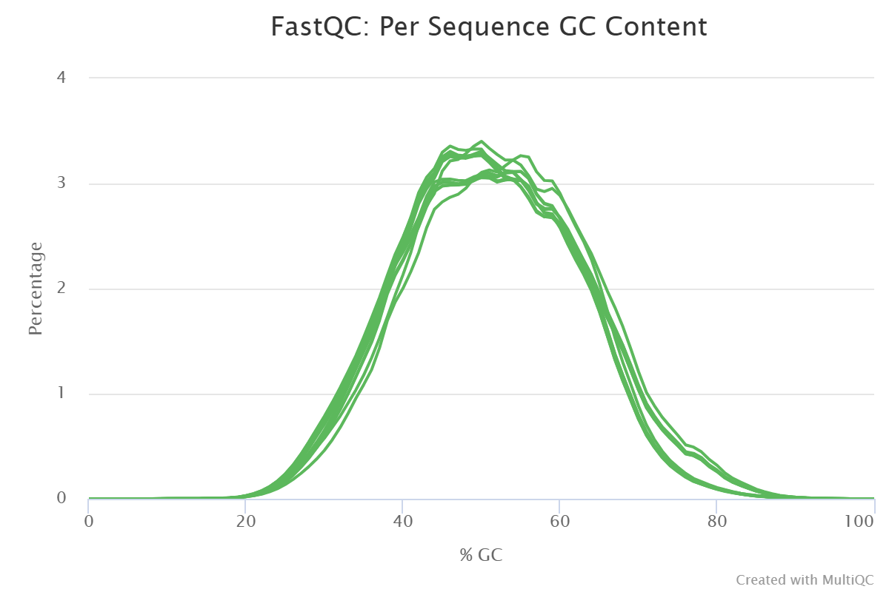
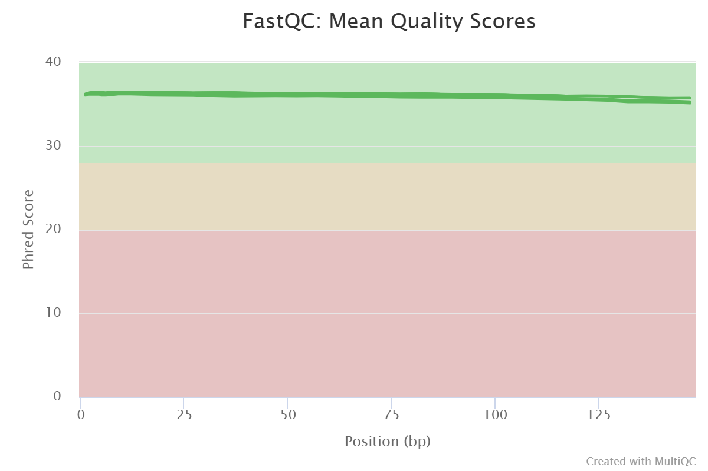
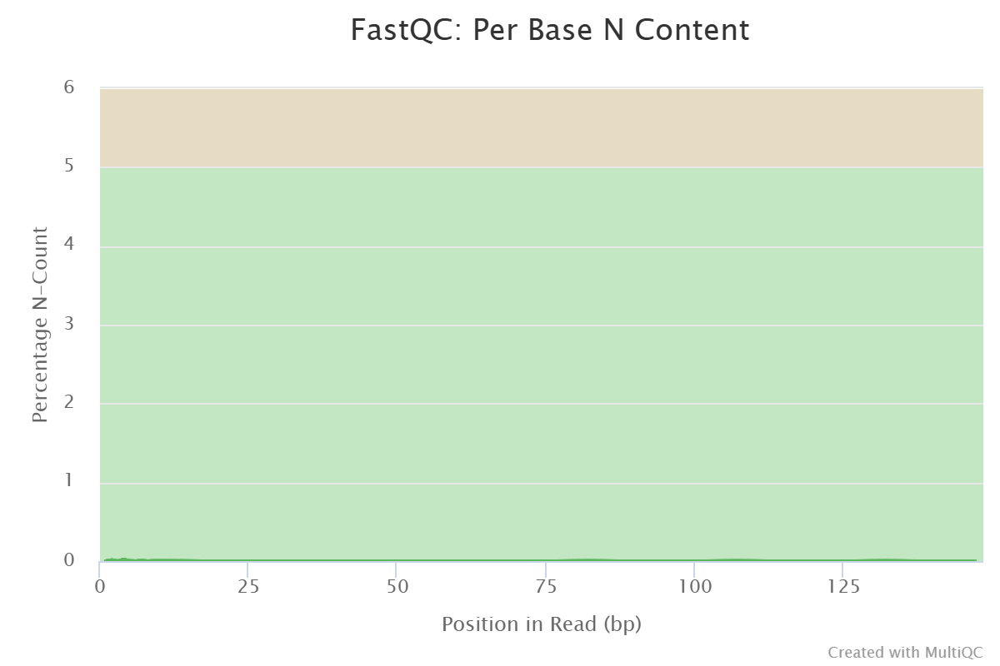

# Descripción del equipo

-   **Equipo:** 2

-   **Integrantes:**

    -   Leonardo González López (lgonzalez) -
        [minestev17\@gmail.com](mailto:minestev17@gmail.com){.email},
    -   Efrén Nosedal González (enosedal) -
        [enosedal\@gmail.com](enosedal@gmail.com),
    -   Yuliana Denisse Sosa Gómez (ysosa) -
        [yuliana.sogo2006\@gmail.com](mailto:yuliana.sogo2006@gmail.com){.email}

# Descripción de los datos

+------------------------------+------------------------------+
| Descripción                  | Información                  |
+==============================+==============================+
| BioProject                   | PRJNA1198873                 |
+------------------------------+------------------------------+
| Especie                      | *Homo sapiens*               |
+------------------------------+------------------------------+
| Tipo de bibliotecas          | *paired-end*                 |
+------------------------------+------------------------------+
| Método de selección          | Purificación de transcritos  |
|                              | poliadenilados (poli-A)      |
+------------------------------+------------------------------+
| Número de transcriptomas     | 6                            |
+------------------------------+------------------------------+
| Número de réplicas           | 3 replicas biológicas por    |
| biológicas                   | condición (control y         |
|                              | knockdown)                   |
+------------------------------+------------------------------+
| Secuenciador empleado        | Illumina NovaSeq 6000        |
+------------------------------+------------------------------+
| Distribución de las muestras | -   **Control**: 3 réplicas  |
|                              |     biológicas WT            |
|                              |     (SRR31732089,            |
|                              |     SRR31732090,             |
|                              |     SRR31732091)             |
|                              |                              |
|                              | -   **Sobreexpresión**: 3    |
|                              |     réplicas biológicas con  |
|                              |     knockdown de *STEAP3*    |
|                              |     (SRR31732086,            |
|                              |     SRR31732087,             |
|                              |     SRR31732088)\n           |
+------------------------------+------------------------------+
| Profundidad de secuenciación | 19 - 24 M seq                |
| de cada transcriptoma        |                              |
+------------------------------+------------------------------+
| Tamaño de las lecturas       | 148 bp                       |
+------------------------------+------------------------------+
| Artículo científico          | Zhao Z, Yu P, Wang Y, Li H   |
|                              | et al. Silencing of STEAP3   |
|                              | suppresses cervical cancer   |
|                              | cell proliferation and       |
|                              | migration via JAK/STAT3      |
|                              | signaling pathway. Cancer    |
|                              | Metab 2024 Dec 30;12(1):40.  |
|                              | PM ID: [3973 675             |
|                              | 1                            |
|                              | ](htt%20%20%20%20%20%20p%%20 |
|                              | 20s:%20%20//%20%%2020www%20% |
|                              | %2020%20.%20n%%202%200c%20bi |
|                              | %20.n%20%20%%2020%20l%20m.n% |
|                              | 20i%%202%200%%%2%2002020h.%2 |
|                              | 0g%%2%20%200%2020o%20%20%20v |
|                              | /p%20%20ub%2%200med/%203%20% |
|                              | 209%%20%2%20020%%20207%2%20% |
|                              | 2003%20%20%%%20202%2%2000%20 |
|                              | 6%207%%20%20%202%200%205%20% |
|                              | 201 "Link to PubMed record") |
+------------------------------+------------------------------+

: Tabla 1: Detalles del Bioproyecto y características de las muestras

## Resumen del BioProject

El artículo “Silencing of STEAP3 suppresses cervical cancer cell
proliferation and migration via JAK/STAT3 signaling pathway” propone
investigar los mecanismos de STEAP3 en la proliferación y migración
celular en cáncer cervical. SYEAP3 pertenece a la familia de las
proteínas STEAP los cuáles se ha reportado que participan en la
proliferación y metástasis del cáncer. Con RNA-seq se comparó la
expresión de las vías de señalización en las cuáles participa STEAP3 en
presencia de STEAP3 (NC) y con knockdown del gen (KD) en células de la
línea celular HeLA.

Se utilizaron todas las muestras del dataset, correspondiendo a 3
réplicas biológicas de células de la línea celular HeLA con knockdown en
el gen STEAP3. La información se encuentra en la **Tabla 2**.

```{r echo=FALSE, message=FALSE, warning=FALSE}
library(DT)

# ejemplo de data frame
df <- data.frame(
  muestras = c("GSM8682795", "GSM8682794", "GSM8682793", "GSM8682792", "GSM8682791", "GSM8682790"),
  condicion = c("STEAP3 knockdown", "STEAP3 knockdown", "STEAP3 knockdown", "WT", "WT", "WT"),
  SampleID = c("SAMN45855841", "SAMN45855842", "SAMN45855843",
                "SAMN45855844", "SAMN45855845", "SAMN45855846"),
  replica_biologica = c("KD_3", "KD_2", "KD_1",
                        "NC_3", "NC_2", "NC_1")
)

# tabla interactiva
datatable(
  df,
  caption = "Tabla 2. Distribución de las muestras y réplicas biológicas",
  options = list(
    pageLength = 6,   # Show 6 entries
    lengthMenu = c(6, 10, 20),
    searching = TRUE,
    paging = TRUE
  )
)
```

# Diagrama de flujo de trabajo


# Calidad de las secuencias de los datos crudos

Se realizó el análisis de calidad de las 6 muestras seleccionadas. Se
obtuvo un contenido de GC aproximado de 50% formando una distribución
normal, característica de un resultado esperado de buena calidad, y una
cobertura que varía del rango de 19M - 24.7M.



Las muestras tienen una calidad óptima dentro de las posiciones de las
lecturas, con valores dentro de la zona verde y un puntaje Phred
superior a 35. De igual forma, las muestras tienen un promedio de
calidad con un pico máximo en Phred 36.




El porcentaje de contenido de bases indeterminadas (N) en los reads
superó la prueba, así como la prueba de secuencias sobrerepresentadas y
no se encontraron muestras con contaminación de adaptadores.



Sin embargo, se identificaron secuencias duplicadas, que posiblemente
puedan estar relacionadas con la presencia de dímeros de adaptadores.


## Conclusión de la calidad de los datos crudos

Al terminar de analizar los datos, concluimos que son adecuados para el
desarrollo del proyecto. Por lo general, las secuencias tienen buena
calidad con valores Phred mayores a 30 y tienen un porcentaje de GC
correcto. Además de que los posibles errores por secuencias duplicadas
se podrían mejorar al remover los adaptadores.

Podemos concluir que podemos continuar utilizando esta base de datos
para análisis futuros, pero debemos realizar la limpieza correspondiente
para mejorar la calidad de los mismos.

# Calidad de las secuencias de los datos procesados

Se realizó el análisis de calidad de las 6 muestras seleccionadas. Se
obtuvo un contenido de GC aproximado de 50% formando una distribución
normal, característica de un resultado esperado de buena calidad, y una
cobertura que varía del rango de 17.9M - 23.2M.


Las muestras tienen una calidad óptima dentro de las posiciones de las
lecturas, con valores dentro de la zona verde y un puntaje Phred
superior a 36.


El porcentaje de contenido de bases indeterminadas (N) en los reads
superó la prueba, así como la prueba de secuencias sobrerepresentadas y
no se encontraron muestras con contaminación de adaptadores los cuales
fueron removidos utilizando `trimmomatic` versión 0.33.


La presencia de secuencias duplicadas se mantuvo como una prueba
fallida, sin embargo, son resultados esperados al realizar RNA-seq.


Se encuentra un sesgo en las primeras 15 bases en la gráfica de Per base
sequence content, sin embargo, se reporta que es normal para RNA-seq.

## Conclusión de la calidad de datos procesados

El procesamiento de los datos utilizando `trimmomatic` versión redujo la
cobertura de las secuencias, indicativo que removió lecturas de mala
calidad, y todos los reads pasaron la prueba de contenido de
adaptadores, por lo cuál indica que fueron removidos.

El tamaño de las reads iniciales (datos crudos) y las finales (datos
procesados) se mantuvo igual.

# Alineamiento de Secuencias

Previo a realizar el alineamiento, se obtuvo el genoma de referencia y
se indexó. El script correspondiente al indexado se puede encontrar
dentro del GitHub, en la ruta `scripts/05_STAR_index.sh`.

Realizamos el alineamiento con STAR con las secuencias de los datos
procesados. El script correspondiente al alineamiento se puede encontrar
dentro del GitHub, en la ruta `scripts/06_STAR_align.sh`.

# Predicción de cuentas

Posterior al alineamiento con STAR, es necesario importar los datos
provenientes de este a R para el posterior análisis de Expresion
diferencial con DESEq2. En nuestro caso, realizamos el análisis con R
versión 4.4.1 dentro del cluster.

El script correspondiente al alineamiento se puede encontrar dentro del
GitHub, en la ruta `scripts/07_Load_data_STAR.R`

Al terminar este script, contamos con una matriz de cuentas crudas de
los datos y cargamos los metadatos. Ambos se encuentran en la ruta de
github `results/counts/raw_counts.RData` como un dataset de R para
cargar.

# Expresión diferencial

Buscamos hacer nuestro análisis de exprsión diferencial a partir de la
matriz de cuentas obtenida. El script correspondiente se puede encontrar
dentro del GitHub, en la ruta `scripts/09_DEG_STAR_KD.R`.

Cargamos nuestra matriz de cuentas crudas generada y la metadata para
posteriormente, seleccionar los genes con más de 10 cuentas.

Al convertirlas al formato dds, observamos que teníamos 6 muestras y
17266 genes hasta este punto. Para después realizar las comparaciones,
indicando cual es la referencia ("WT"). Guardamos el resultado de la
salida en el archivo `results/STEAP3_KD_vs_WT.RData` el cual contiene la
metadata y el archivo dds.

Posteriormente, hicimos la normalización de los datos para evitar sesgos
técnicos y biológicos. Utilizamos la función `rlog` debido a que tenemos
pocas muestras (\<30).

Finalmente, pudimos detectar que no hay Batch Effect tras hacer el PCA
de las cuentas, donde podemos notar las diferencias entre muestras con
las componentes que explican la mayor cantidad de varianza en nuestros
datos, donde se observa que se agrupan las muestras control (WT) y dos
de las muestras de células con knockdown del gen STEAP3 se agrupan
mientras que la muestra restante de los casos se encuentra alejada de
todas las demás.


Obtuvimos la información del único contraste entre Wild-Type y
Knockdown, y guardamos los resultados en el archivio
`results/DE_KD_vs_WT.csv`. Dentro de él podemos observar que en el
resumen se reportan 744 genes con un LFC \> 0, y 825 con un LFC \< 0.

## Visualización de los datos

Algunas de las gráficas generadas a partir de estos datos se muestran a
continuación.

Previamente, se filtraron los genes que tuvieran un p-valor ajustado
menor a 0.05. Y, sumado a ello, para clasificarlos como up-regulated que
tuvieran LFC ≥ 2, y para down-regulated LFC ≤ 2.

Para el Volcano Plot, observamos 3 genes down-regulated y 12 genes
up-regulated. El gen down-regulated con mayor p-value es *STEAP3* y el
gen up-regulated con mayor p-value es *SERPINB3*.


Por otro lado, realizamos un Heatmap, donde obtuvimos los 20 genes con
el p-valor más significativo, y creamos un filtro donde el Log Fold
Change máximo fuera 3, de esta manera evitamos sesgar los resultados por
los outliers.


# Análisis funcional

Realizamos la determinación funcional de los genes diferencialmente
expresados a partir de los datos. El script correspondiente se puede
encontrar dentro del GitHub, en la ruta `scripts/10_GO_terms_STAR.R`.

Se realizó el mismo filtrado que realizamos en la sección de
"Visualización de los datos" para realizar las gráficas.

Primero, realizamos un Manhattan plot. Mediante este plot podemos
observar la cantidad de vías metabólicas observadas en cada base de
datos, representadas por un punto del color correspondiente.


Por otro lado, también podemos realizar una gráfica de barras con la
información de los genes down-regulated, ordenados por su p-valor y
categoría. En esta gráfica podemos observar las vías metabólicas
relacionadas a los genes down-regulated, y de igual forma de que base de
datos provienen cada una de ellas.

Algunas vías relacionadas a los genes que disminuyen su expresión son:

-   **Ferroptosis**: una forma de muerte celular programada dependiente
    de hierro.

-   **Metabolismo del cobre y hierro:** importación de iones de cobre y
    hierro, concentración epática elevada de hierro, transporte y
    abosrbción de hierro, metabolismo del hierro en la placenta,
    desórdenes del metabolismo del hierro, homesotasis del cobre,
    saturación de la transferina (proteína que transporta hierro)

-   **Crecimiento** celular y regulación de *TP53*

-   **Contracción muscular**: contracción del corazón, músculo liso de
    la vena, músculo liso arterial, músculo liso tónico, etc

-   **Ciclos de GTPasas:** *RHOJ*, *RHOO*, *RHOF*, *RHOD*


De igual forma podemos observar las vías metabólicas relacionadas a los
genes up-regulated. Algunas vías son:

-   **Proteólisis**: regulación negativa de actividad de peptidasas,
    hidrolasas, actividad catalítica y funciones moleculares

-   **Respuesta inmune:** respuesta a virus, respuesta simbionte,
    respuesta a otros organismos, estímulos bióticos o estímulos
    externos, respuesta de defensa, regulación del sistema inmune,
    regulación de linfocitos, respuesta a estrés, señalización autócrina
    y parácrina


# Discusión

# Referencias

-   Zhao, Z., Yu, P., Wang, Y., Li, H., Qiao, H., Sun, C., Zhu, L., &
    Yang, P. (2024). Silencing of STEAP3 suppresses cervical cancer cell
    proliferation and migration via JAK/STAT3 signaling pathway. *Cancer
    & metabolism*, *12*(1), 40.
    <https://doi.org/10.1186/s40170-024-00370-2>

-   Ferroptosis, un mecanismo de muerte celular presente en β-talasemia
    menor. (2024). *Revista Bioquímica Y Patología Clínica*, *89*(1),
    19-26. <https://doi.org/10.62073/k7g1yk82>
